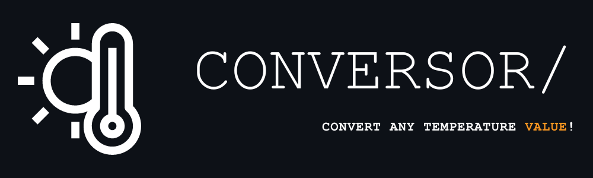

<h1>Welcome to...</h1>

<h2>That's a simple project to automatically convert any temperature value.</h2>

I made this project, just for study in Python.

  

Formula Types:

K -> C: C = K - 273; 
K -> F: (K-273) * 1,8 + 32; 
C -> K: K = C + 273; 
C -> F: F = C * 1,8 + 32; 
F -> C: F = (F-32) / 1,8; 
F -> K: K = (F-32) * 5/9 + 273; 

